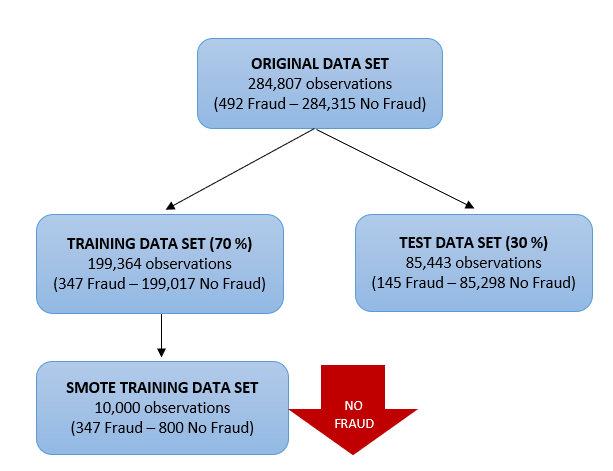

```{r setup, include=FALSE}
knitr::opts_chunk$set(echo = FALSE)
```


&nbsp;


<center> {width=1cm} </center>
<p></p>
<center><strong> CONTEXTE </strong></center>
<p></p>
Il est important que les sociétés émettrices de cartes de crédit soient en mesure de reconnaître les transactions frauduleuses par carte de crédit afin que les clients ne soient pas facturés pour des articles qu'ils n'ont pas achetés.
<p></p>

<center> {width=1cm} </center>
<p></p>
<center><strong> CONTENU </strong></center>
<p></p>
Les jeux de données contiennent les transactions effectuées par carte de crédit en septembre 2013 par les titulaires de carte européennes.
Cet ensemble de données présente les transactions survenues en deux jours, dans laquelle nous avons <strong>492 fraudes sur 284 807 transactions.</strong>
L'ensemble des données est très déséquilibré, la classe positive (fraude) représente seulement 0,17 % de toutes les transactions.

|            | Fréquence | Pourcentage |
|:-----:|:-----:|:-----:|
| Fraud     |    492    | 0,17%     |
| No Fraud | 284.315    | 99,83%     |

Malheureusement, en raison de problèmes de confidentialité, nous ne sommes pas en mesure de fournir ni les caractéristiques d'origine, ni  d'informations complémentaires sur les données. Les variables V1, V2, ..., V28 sont les principales composantes obtenues avec ACP. Les seules fonctionnalités qui n'ont pas été transformées avec ACP sont 'Time' et 'Amount'.

| Variables       | Description                                                                                    |
|:---------------:|:-----------------------------------------------------------------------------------------------|
| V1,...,V28      | Principales composantes (anonyme)                                                              |
| Time            | Secondes écoulées entre chaque transaction et la première transaction de l'ensemble de données |
| Amount          | Montant de la transaction                                                                      |
| Class           | Variable de réponse (1 en cas de fraude 0 sinon)                                               |

<strong>Correction et traitements apportés</strong> : Nous avons séparés la base de donnée en un échantillon d'apprentissage et un échantillon test, à hauteur respectivement de 70 % et 30 %. Par la suite, nous avons réalisé un sous-échantillonnage (under sampling) sur l'échantillon d'apprentissage.
<p></p>
<center> {width=12cm}</center>


&nbsp;
<p></p>
<center> {width=1cm} </center>
<p></p>
<center><strong> OBJECTIFS </strong></center>
<p></p>
Identifier les transactions frauduleuses par carte de crédit. Étant donné le rapport de déséquilibre de la variable de réponse (Class), <strong>nous allons mesurer la précision de notre modèle à l'aide de plusieurs indicateurs de sélection afin de choisir le modèle le plus adapté. </strong>


&nbsp;
```{r, echo=FALSE}
library(htmltools)
htmltools::img(src = knitr::image_uri(file.path("www/logoESA.png")), 
               alt = 'logo', 
               style = 'position:absolute; bottom:1; right:0; padding:10px;width:2cm')
```


&nbsp;


