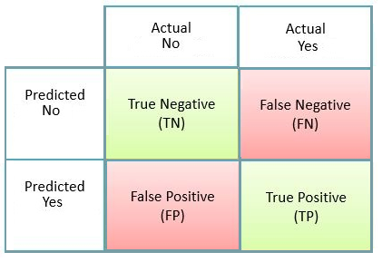
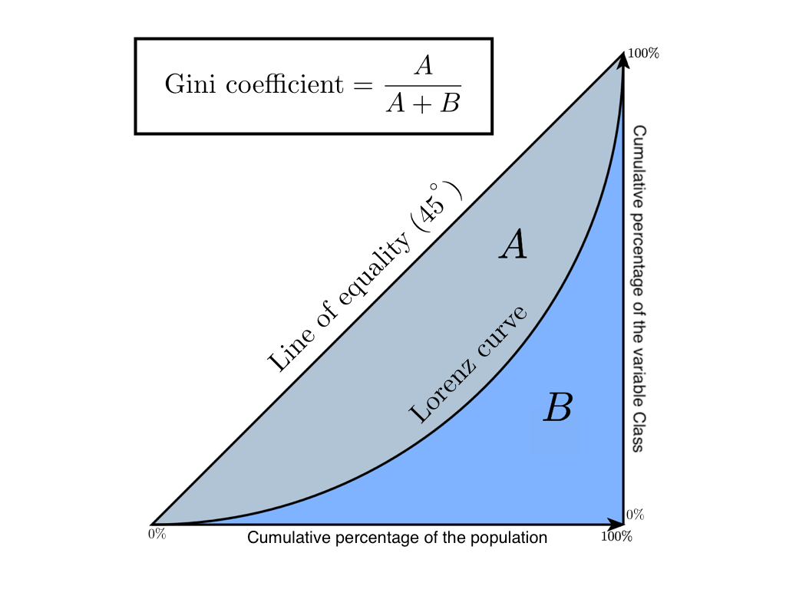

```{r setup, include=FALSE}
knitr::opts_chunk$set(echo = FALSE)
```
<p>
</p>
<strong>Notions of confusion matrix, sensitivity, specificity and precision</strong>

<center><strong> Confusion matrix </strong></center>
<p>
</p>

<center>{width=10cm}</center>

We will take the case of a pregnancy test that classifies each individual in the population as pregnant (positive) or non-pregnant (negative).
<p></p>

* True Positive (TP) - a person considered pregnant when this is true.
* True Negative (TN) - a person considered as non-pregnant when this is true
* False Negative (FN) - a person considered non-pregnant while pregnant
* False Positive (FP) - a person who is considered pregnant but is not pregnant

| Sensitivity / Recall | Specificity | Precision | Accuracy |
|:-----:|:-----:|:-----:|:-----:|
| Sensitivity  is  the  proportion  of  true  positives  that  are  correctly  identified  by  a  diagnostic test. It shows how good the test is at detecting a disease. $$ Sensitivity = Recall = \frac{TP}{TP + TN} $$ | Specificity is the proportion of the true negatives correctly  identified  by  a  diagnostic  test.  It  suggests  how  good  the  test  is  at  identifying  normal  (negative)  condition. $$Specificity = \frac{TN}{TN + FP}$$ | Measures how many of those that were positively rated were relevant. A test can maximize accuracy by returning positive for only one result to which it is most reliable. $$Precision = \frac{TP}{TP + FP}$$ | Accuracy is the proportion of true results, either true positive or true negative, in a population. It measures the degree of veracity of a diagnostic test on a condition $$Accuracy= \frac{TN+TP}{TP+TN+FP+FN}$$ |

<center><strong> Indice de Gini </strong></center>
<center>Lorenz or CAP in the statistical field correlates the rate of true positives with the rate of samples considered. This curve can be interpreted using the Gini coefficient, which is equal to the ratio of the area A to the total area of the triangle. It is a measure of unequal distribution. </center>
<p>
</p>
<center>{width=10cm}</center>