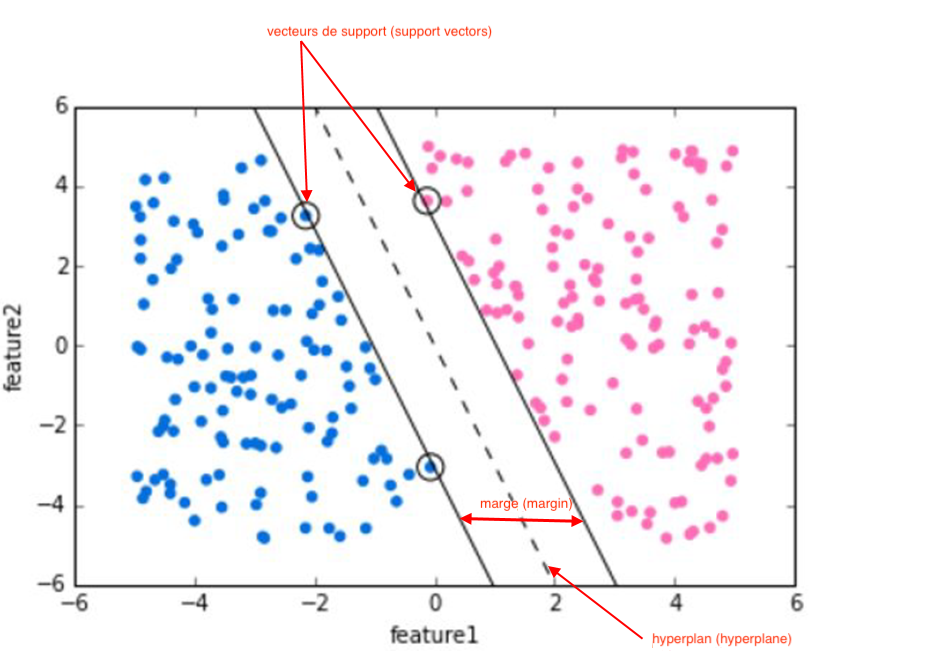
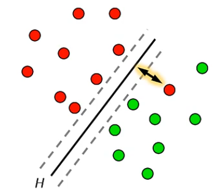
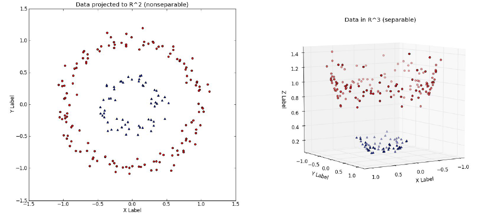
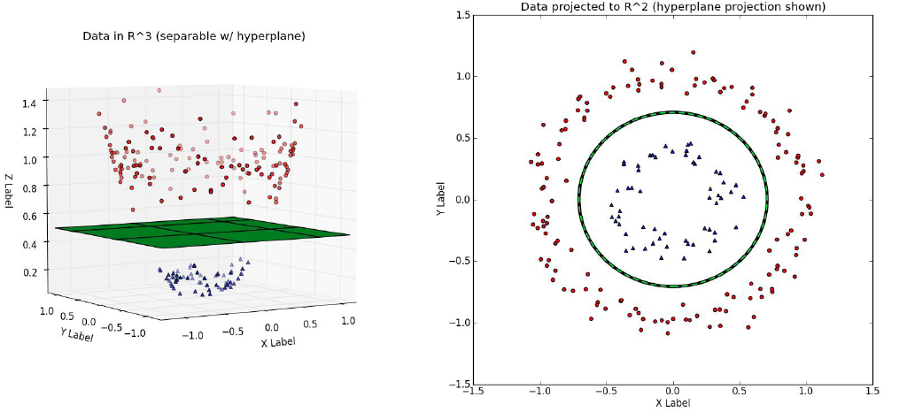

```{r setup, include=FALSE}
knitr::opts_chunk$set(echo = FALSE)
```


&nbsp;

<strong>Les machines à vecteurs de support sont un ensemble de techniques d’apprentissage supervisé destinées à résoudre des problèmes de classification ou de régression. Les SVM sont aussi appelés séparateurs à vastes marges.</strong>
<p></p>
Les machines à vecteurs de support reposent sur deux idées clés :

<center><strong> 1. Marge maximale </strong></center>
<p>
</p>
<strong>La marge est la distance entre la frontière de séparation (hyperplan) et les observations les plus proches.</strong> Ces derniers sont appelés vecteurs supports. Dans les SVM, la frontière de séparation optimale est choisie comme celle qui <strong>maximise la marge.</strong> Le problème consiste à trouver cette frontière séparatrice optimale à partir d’un ensemble d’apprentissage. La solution consiste à formuler le problème comme un problème d’optimisation quadratique.


<center>{width=15cm}</center>


Lorsque les données ne sont pas séparables linéairement, une solution est une machine vectorielle de support connue sous le nom d'hyperplan à marge souple. Un hyperplan soft margin comporte des erreurs de classification. C'est à l'analyste de décider si le rendement des données de validation est acceptable.
<p></p>
<center>{width=7cm}</center>
 $$Penalité = 2 * distance$$ 
<p></p>
Dans un espace d'entrée bidimensionnel, le soft margin signifie qu'une ligne peut séparer la plupart des points, mais que certaines erreurs se produisent. Nous tenons compte des erreurs en utilisant un terme de pénalité dans le processus d'optimisation. Cette pénalité est le produit de deux grandeurs : un poids d'erreur, qui est un paramètre de régularisation souvent désigné par C, et la distance entre un point d'erreur et l'hyperplan.


&nbsp;


<center><strong> 2. Kernel trick </strong></center>
<p>
</p>
Dans le cas où les données ne sont pas linéairement séparables, la deuxième idée clé des SVM est de <strong>transformer l’espace de représentation des données d’entrées en un espace de plus grande dimension </strong>(possiblement de dimension infinie), dans lequel il est probable qu’il existe une séparation linéaire. 


&nbsp;

<center></center>
<p>
</p>
L’astuce consiste à utiliser une fonction noyau qui ne nécessite pas la connaissance explicite de la transformation à appliquer pour le changement d’espace. <strong>Les fonctions noyau</strong> permettent de transformer un produit scalaire (calcul coûteux dans un espace de grande dimension) en une simple évaluation ponctuelle d’une fonction.


&nbsp;

<center></center>
<p></p>

<center><strong> Kernels Usuels </center></strong>

| Nom du noyau | Formules |
|:-------------------------|:------------------:|
| Noyau linéaire | $$K(x_i,x_j) = <x_i,x_j>$$  |
| Noyau Polynomial de degré p (hyperparamètres : $c,p$) |$$K(x_i,x_j)=(c+<x_i,x_j>)^p$$ |
| Noyau Radial Basis Function (RBF) ou Gaussien (hyperparamètre : $\sigma$) | $$ K(x_i,x_j)= exp (-\frac{||x_i-x_j||^2} {2\sigma^2 })$$ |
| Noyau Sigmoïde (hyperparamètres : $\theta_1,\theta_2$) | $$K(x_i,x_j)= tanh (\theta_1<x_i,x_j>+ \theta_2)$$ |

<p></p>
<u>Au final, la démarche du SVM avec transformation de l’espace de représentation des données d’entrée est la suivante :</u>

* Sélection de la fonction Kernel
* Sélection des hyperparamètres et du paramètre de pénalisation C sur une base d’entrainement (training) par cross-validation
* Mesure de la performance prédictive sur une base de test.


&nbsp;

```{r, echo=FALSE}
library(htmltools)
htmltools::img(src = knitr::image_uri(file.path("www/logoESA.png")), 
               alt = 'logo', 
               style = 'position:absolute; bottom:1; right:0; padding:10px;width:2cm')
```


&nbsp;

